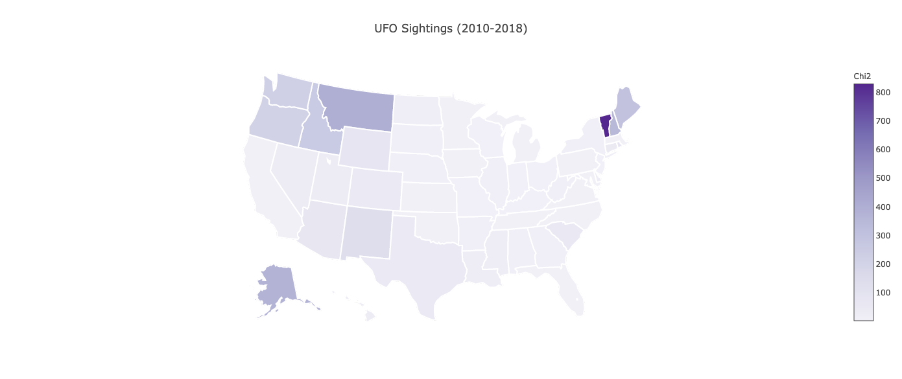
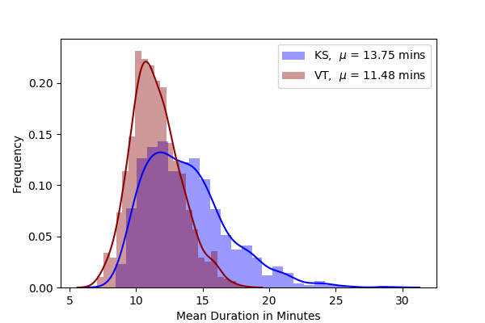
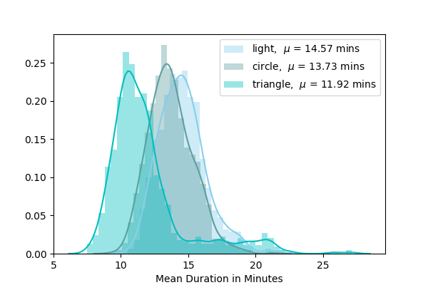

# UFO REAL
## Travel Agency
Filis Coba, Angel Manzur

## Data science Module 3: Project

Ever wonder where to go for UFO sigthsing? Look no more! in this document we'll analyze the data from +100 thousand of reports collected over the past 50 years and tell you where you should go, and what you can expect to see.

### Data
For this project we collected the data from the [National UFO Reporting Center](http://www.nuforc.org/index.html)

For each report the data contains the folling information

| Column        | Descritption |
| ------------- |:------------:| 
| Date/ Time    | Date and time of the events |
| City          | City where of the sighting |
| State         | State or province where of the sighting |
| Shape         | Shape of the object observed |
| Duration      | Duration of the event |
| Summary       | Descrption of the event |
| Posted        | Date when the event was posted to the database |

In order to compare the number of UFO sightings between the different states, we also collected the population from the [United States Census Bureau](https://www.census.gov/). 

The census data we used contains the total population for each of the 50 US states per year, from 2010 to 2018. 
To use the census data we groupd out UFO data by state and by year and counted how many sightings happened between 2010 and 2018. 

#### Collecting an cleaning the data.
For the ufo data, we scrapped the data from the website. For this analysis we scrapped the pages summarizing the sightings per month [like this one](http://www.nuforc.org/webreports/ndxe201905.html) instead of scrapping each individual report, as shown [here](http://www.nuforc.org/webreports/146/S146041.html). The downside of scrapping the summary table,  is that we do not have the full description of the event, so will not use this informatin for this analysis. Below is a sample of the data

| |	Date_Time	|City|	State	|Shape|	Duration	|Summary	|Date_Posted|
|-----:|--------:|--------:|----:|--------:|--------:|------------:|--------:|
|0	|5/9/19 21:15	|Cincinnati	|OH	|Triangle	|15 seconds	|Large V/triangle-shaped craft that moved silen...	|5/9/19	|
|1 |5/8/19 23:00	|Statesboro	|GA	|Triangle	|20 seconds	|Two UFO's near Statesboro, Ga. 11:00 PM 5-9-2019.	|5/9/19	|
|2	|5/8/19 23:00	|Norfolk	|VA	|Light	|>10 minutes	|Extremely loud bang, light spotted in sky.	|5/9/19	|
|3	|5/8/19 01:30	|Saint George	|UT	|Other	|1:30	|Started noticing a huge flash of light @ aroun...	|5/9/19	|
|4	|5/8/19 01:00	|Highlands	|NC	|Light	|1 minute	|I have about 10 recordings from last night on ...	|5/9/19	|

The data needs some cleaning before we can start analyzing it. In the input forms, the field `Duration` is collected as a string, resulting in a variety of formats. The most common are the duration time as seconds, minutes or hours (for example `5 minutes` or `2:30` or `1 hour & 30 minutes`), a time interval (like `10-15 minutes`) or give a limit (`>1 minute`). In addition to dealing with the different formats, we had to take into account the most common typos, such as writing `2O` instead of `20`.

After converting the duration time into seconds and removing the rows with a null value, or where we could not find a number, 
50% of our time in this project was dedicated on cleaning, we eneded with ~87,700 reports out of the original ~110,000.

The census data we selected showed the total population by state and by year from 2010 to 2018. There was no need to clean this data.

### Preliminary EDA

After looking at the data, ur first question was, where should we go to see some ufos? To answer this, we counted the total number of sightings per state, finding that California has the highest number


This way of looking at the data doesn't give us a lot of information when compared to other states because the population of California is much larger than smaller states, such as Rhode Island. To do a true comparison we loaded up the census data to get the number of sightings per capita. This analysis is reported in the next section. 

From the `Shapes` column we found there are +40 shapes reported, the top three being 

| Top Shapes (out of 43)       |  % |
| ------------- |:------------:| 
| Light   | 21.2 |
| Circle          | 10.6 |
| Triangle      | 9.9 |


### Data Analysis
To answer, which state has the higher activity per capita, we imported the data from both databases into a single SQL database, using `sqlite3`. We used the different SQL commands to group and sum the information we needed, 
for example to count all the sighting by state and by year we did

```sql
SELECT state , 
 sum(CAST ("y2010" AS int)) as N2010, 
 sum(CAST ("y2011" AS int)) as N2011, 
 FROM 
 	(SELECT state , 
 	 COUNT( CASE WHEN strftime('%Y', event_date) = '2010' THEN shape END) AS 'y2010', 
 	 COUNT( CASE WHEN strftime('%Y', event_date) = '2011' THEN shape END) AS 'y2011', 
 	 strftime('%Y', event_date) as year FROM ufos 
 	 GROUP BY strftime('%Y',event_date), state)
 GROUP BY state
 ```
 The result was then loaded into a pandas DataFrame, and then joined to a second dataframe containing tthe population number.  
 To calculate the number of sights per capita, we simplly divide the number of sights for a particular state and year by the population for that same state and year. 
 
 To compare if any state had a an unusual number of sights, we compare the sights per capita to the average number of sights for the whole country, and then perform  Chi2 test. The average number of sights is calculated as the total number sightings divided by the total population for each year.
 The plot below shows the average sightings per year (bottom purple curve), and the three states with the highest Chi2 value: Vermont, Montana, and Alaska. This data agrees with reports from other sources, for example, the [Washington Post](https://www.washingtonpost.com/blogs/govbeat/wp/2014/03/05/the-most-per-capita-ufo-sightings-last-year-were-in-maine-and-arizona/?utm_term=.9429b36830ad) reported Vermont as one of the most UFO sightings per capita in 2013. 
 
 
 
 The plot below shows the Chi2 result after comparing sights per year per state between 2010 and 2018. Vermont has the highest Chi2 value. Even though California has the highest number of reports, it also has a very high population which lowers the number of sights per capita. 


### Duration in the sky vs states.
Next we asked if the duration of the object in the sky was different between different states. The plot below shows the mean duration for UFO sightings for Vermont and Kansas. Both distributions were selected by randomly selecting events from the data, for both states.   

AFter collecting the samples, we performa t-test on both samples finding a p-value = 9.804e-75. Thus rejecting the null hypothesis that both distribution have equal means. 

### Duration in the sky vs shapes.
Similarly to lookng at duration of the UFO by state, we compare the duration in the skies by shape. Initially we performed an ANOVA test, to test the null hypothesis that all shapes have the same mean duration time. 

The reuslts from the ANOVA tests are shown in the table below:

|              | df   |     sum_sq   |    mean_sq    |      F    |    PR(>F) |
| ------------ |:--------:| --------:| --------:| --------:| --------:|
|C(Shape)   |  42.0 | 1.24e+06 | 29453.31 | 10.75  | 8.41e-70 |
|Residual | 87706.0 | 2.40e+08 |  2740.80 |       NaN   |        NaN |

Based on the p-vale (8.41e-70), we reject the null hypothesis that all shapes have the same mean duration times. Since there are 40+ shapes, we limit our analysis to the three most common shapes: Light, Circle, and Triangle. As with the comparison between states, we randomly select events from the orignal distributions, the results are shown below:



Finally we perform a t-test on these distributions, the p-values are summarized in the following table

| Shapes |  p-value |
| -------------|:-------------:|
| Circle & Triangle | 3.64-59 |
| Circle & Light | 1.67e-27 |
| Light & Triangle | 1.86e-112 | 

Based on the p-values above, the three means are different between these shapes. 

# Summary
We analyzed more than 80,000 UFO report, along witht he census data from 2010 to 2018, we found the state with the most number of UFO sightings for that period: Vermont! Followed bt Montana and Alaska. 
Note that theses states have larger areas with rural population, translating into less light polution, which could explain the higher number of sightings. The also tend to have lower populations which makes the number of sightings per capita much higher than states where UFO sightings may be more commone like California or Nevada (think Area 51).

We also showed that the mean duration of the UFO sighting can vary from state to state and between the shape of the object observed. This could indicate that the sightings are due to different phenomena, for example a shooting star would not last as long as a satelite or the international space station.

